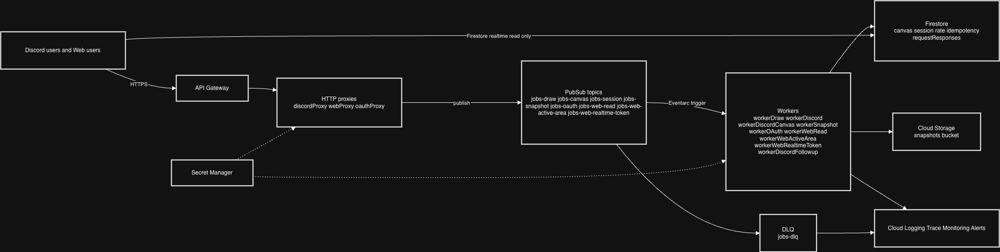

# Serverless Felix

Collaborative pixel canvas inspired by r/place, with Discord commands and a web UI.

Cloud provider: GCP only.
Architecture style: fully serverless, event-driven, asynchronous.

## 1. Scope

This project implements:

- Discord bot interactions through API Gateway
- Web app with authenticated draw actions
- Pub/Sub based asynchronous processing
- Firestore persistence with concurrency control
- Snapshot generation in Cloud Storage
- Monitoring, alerts, structured logging, tracing

## 2. Requirements Coverage

| Subject / Recommendation | Implementation |
|---|---|
| Public endpoints through API Gateway | `/discord`, `/web/*`, `/oauth` on API Gateway |
| Proxy then queue (async first) | `discordProxy`, `webProxy`, `oauthProxy` only validate/ack/enqueue |
| Worker SRP | Dedicated workers per responsibility (`workerDraw`, `workerSnapshot`, etc.) |
| Event-driven architecture | Pub/Sub topics + Eventarc triggers for workers |
| Discord commands | `draw`, `canvas`, `session`, `snapshot` |
| Session admin controls | `start`, `pause`, `reset` with admin role check |
| Snapshot flow | Snapshot worker renders PNG, uploads to bucket, returns signed URL to Discord |
| Persistent storage | Firestore for canvas/session state, Cloud Storage for snapshots |
| Per-user rate limit | Transactional counter in Firestore (`RATE_LIMIT_PER_MINUTE`) |
| Pixel metadata | `authorId`, `authorUsername`, `updatedAt` stored per pixel |
| OAuth authentication | Discord OAuth2 + backend exchange + HttpOnly session cookie |
| Near real-time web canvas | Firestore listeners on chunk docs, fallback polling path |
| Security | Least-privilege service accounts, secrets in Secret Manager, no public Cloud Run invoker |
| Monitoring and alerts | Cloud Monitoring dashboard + policies (5xx, backlog, message age, DLQ) |
| Logging and tracing | Structured JSON logs + correlation/request/trace IDs + OpenTelemetry spans |
| Reliability | DLQ + delivery attempts + retry policy + TTL cleanup |

## 3. Architecture



## 4. Components

### 4.1 Proxies (HTTP entrypoints only)

- `discordProxy`: verifies Discord signature, validates slash command payload, enqueues job, immediately acknowledges.
- `webProxy`: validates session cookie, validates request payload, enqueues jobs for draw/read/token workflows.
- `oauthProxy`: starts OAuth redirect and enqueues code exchange job after callback validation.

### 4.2 Workers

- `workerDraw`: idempotency, session-state check, rate limit check, pixel write transaction.
- `workerDiscord`: handles session admin actions (`start`, `pause`, `reset`).
- `workerSnapshot`: loads active canvas area, renders PNG, uploads to bucket, writes latest snapshot metadata.
- `workerDiscordCanvas`: returns latest snapshot to Discord.
- `workerOAuth`: exchanges Discord OAuth code, fetches user, creates Firebase custom token, stores session.
- `workerWebRead`: resolves canvas window data asynchronously.
- `workerWebActiveArea`: resolves active area asynchronously.
- `workerWebRealtimeToken`: creates Firebase custom token asynchronously.
- `workerDiscordFollowup`: generic Discord follow-up publisher.

### 4.3 Data stores

- Firestore:
  - `chunks/{chunkId}/pixels/{pixelId}`: canvas pixels
  - `activeArea/current`: current active canvas bounds
  - `config/session`: round state (`running` / `paused`)
  - `sessions/{state}`: OAuth sessions
  - `requestResponses/{requestId}`: async request-response records for web reads
  - `idempotency/{eventId}`: duplicate protection
  - `rate/{userId}/minutes/{yyyyMMddHHmm}`: per-user draw rate counters
- Cloud Storage:
  - `gs://serverless-felix-dev-snapshots/snapshots/...` snapshot files

## 5. Why direct Firestore listeners for realtime

This project uses a strict split between **mutations** and **realtime reads**:

- All external commands and state changes go through `API Gateway -> HTTP proxy -> Pub/Sub -> worker`.
- This includes Discord commands, web draw actions, OAuth flow, session controls, and snapshot requests.
- Business logic and writes remain server-side only (workers + Firestore/Storage).

Realtime canvas reads use direct Firestore listeners as an optimization:

- lower latency than API polling for high-frequency pixel updates
- lower backend load and lower cost under concurrent viewers
- native incremental change streams instead of full window refetches

Security and compliance guardrails for this choice:

- Firestore client rules are read-only for authenticated users on canvas docs; client writes are denied
- users must first authenticate through Discord OAuth and receive backend-issued session/realtime tokens
- API-backed async read paths still exist (`/web/canvas`, `/web/active-area`) as fallback and for controlled access patterns

Compliance note for defense:

- We keep the required event-driven serverless pipeline for all workload mutations.
- Direct Firestore listeners are used only for low-latency, read-only projection of already-processed state.

## 6. Security Model

- API Gateway is the only public API entrypoint.
- Cloud Run invoker is restricted:
  - proxies invokable by `api-gateway-invoker` service account
  - workers invokable by Eventarc/PubSub service agents + dedicated worker service account
- Service account per function group, not one shared runtime identity.
- Secrets stored in Secret Manager (`discord_public_key`, `discord_client_id`, `discord_client_secret`, `oauth_redirect_uri`).
- Discord request signature validation in `discordProxy`.
- OAuth state cookie validation in `oauthProxy`.
- Web session cookie is `HttpOnly`, `Secure`, `SameSite=None`.
- Firestore client rules are read-only for authenticated users on canvas docs, no client write permission.
- Snapshot links are signed URLs with TTL (not public objects).

## 7. Observability and Reliability

- Structured JSON logs with:
  - `correlationId`
  - `requestId`
  - `traceId`
- OpenTelemetry spans exported to Cloud Trace.
- Dashboard includes:
  - Cloud Run request rate / errors / latency
  - Pub/Sub backlog
  - oldest unacked age
- Alerts:
  - Cloud Run 5xx spike
  - Pub/Sub backlog depth
  - Pub/Sub oldest unacked age
  - DLQ non-empty
- DLQ:
  - topic: `jobs-dlq`
  - worker subscriptions configured with dead-letter policy
- TTL enabled:
  - `sessions.expiresAt`
  - `idempotency.createdAt`
  - `requestResponses.expiresAt`

## 8. Repository Layout

```text
src/functions/proxies/      HTTP proxies
src/functions/workers/      Pub/Sub workers
src/functions/shared/       shared libs (queue, tracing, validation, observability)
gateway/                    OpenAPI template for API Gateway
monitoring/                 dashboard and alert policy templates
scripts/                    deploy and infra automation scripts
web/                        frontend (Vite + Firebase client SDK)
runbook.md                  detailed operational runbook
```

## 9. Prerequisites

- Node.js + npm
- gcloud CLI authenticated
- Firebase CLI (via `npx firebase-tools` is enough)
- GCP project access (`serverless-felix-dev`)
- Discord app credentials

## 10. Setup and Deploy

### 10.1 Install

```bash
npm ci
npm --prefix web ci
```

### 10.2 First-time bootstrap (new GCP project)

Set project and region:

```bash
export PROJECT_ID=serverless-felix-dev
export REGION=europe-west1
gcloud config set project "$PROJECT_ID"
```

Enable required APIs:

```bash
gcloud services enable \
  cloudfunctions.googleapis.com \
  pubsub.googleapis.com \
  apigateway.googleapis.com \
  servicemanagement.googleapis.com \
  servicecontrol.googleapis.com \
  firestore.googleapis.com \
  storage.googleapis.com \
  secretmanager.googleapis.com \
  artifactregistry.googleapis.com \
  cloudbuild.googleapis.com \
  run.googleapis.com \
  eventarc.googleapis.com \
  logging.googleapis.com \
  monitoring.googleapis.com \
  cloudtrace.googleapis.com \
  firebase.googleapis.com \
  firebasehosting.googleapis.com
```

Create Firestore and snapshot bucket:

```bash
gcloud firestore databases create \
  --project "$PROJECT_ID" \
  --database="(default)" \
  --location="$REGION" \
  --type=firestore-native || true

gcloud storage buckets create "gs://serverless-felix-dev-snapshots" \
  --location="$REGION" \
  --uniform-bucket-level-access || true
```

Create secrets (values must be provided by your Discord app config):

```bash
for SECRET in discord_public_key discord_client_id discord_client_secret oauth_redirect_uri; do
  gcloud secrets create "$SECRET" --project "$PROJECT_ID" --replication-policy=automatic || true
done
```

Add secret versions:

```bash
echo -n "$DISCORD_PUBLIC_KEY" | gcloud secrets versions add discord_public_key --project "$PROJECT_ID" --data-file=-
echo -n "$DISCORD_CLIENT_ID" | gcloud secrets versions add discord_client_id --project "$PROJECT_ID" --data-file=-
echo -n "$DISCORD_CLIENT_SECRET" | gcloud secrets versions add discord_client_secret --project "$PROJECT_ID" --data-file=-
```

### 10.3 Deploy backend and platform

```bash
npm run deploy:dev
npm run deploy:dev:gateway
npm run deploy:dev:reliability
npm run deploy:dev:ttl
npm run deploy:dev:monitoring
npm run deploy:dev:alerts
```

Set OAuth redirect secret to the active gateway URL:

```bash
export DEV_GATEWAY_HOST=$(gcloud api-gateway gateways describe serverless-felix-dev-gateway \
  --location="$REGION" \
  --project="$PROJECT_ID" \
  --format='value(defaultHostname)')

export OAUTH_REDIRECT_URI="https://${DEV_GATEWAY_HOST}/oauth"
echo -n "$OAUTH_REDIRECT_URI" | gcloud secrets versions add oauth_redirect_uri \
  --project "$PROJECT_ID" --data-file=-

npm run deploy:dev:oauthProxy
npm run deploy:dev:workerOAuth
```

Create API key for protected `/web/*` routes:

```bash
export GATEWAY_MANAGED_SERVICE=$(gcloud api-gateway apis describe serverless-felix-dev \
  --project "$PROJECT_ID" \
  --format='value(managedService)')

export GATEWAY_API_KEY=$(gcloud services api-keys create \
  --project "$PROJECT_ID" \
  --display-name="serverless-felix-web-dev" \
  --api-target="service=${GATEWAY_MANAGED_SERVICE}" \
  --allowed-referrers="https://serverless-felix-dev.web.app/*,http://localhost:*/*" \
  --format='value(keyString)')
```

### 10.4 Deploy web

```bash
export VITE_API_GATEWAY_URL="https://${DEV_GATEWAY_HOST}"
export VITE_API_GATEWAY_KEY="$GATEWAY_API_KEY"

npm --prefix web run build
npx --yes firebase-tools deploy \
  --project serverless-felix-dev \
  --only firestore:rules,firestore:indexes,hosting \
  --config web/firebase.json \
  --non-interactive
```

### 10.5 Register Discord slash commands

```bash
DISCORD_APP_ID="<app_id>" \
DISCORD_BOT_TOKEN="<bot_token>" \
DISCORD_GUILD_ID="<guild_id>" \
npm run discord:commands
```

Set Discord portal values:

- Interactions endpoint: `https://${DEV_GATEWAY_HOST}/discord`
- OAuth redirect URI: `https://${DEV_GATEWAY_HOST}/oauth`

## 11. Runtime Configuration

Core variables:

- `DISCORD_PUBLIC_KEY`
- `DISCORD_CLIENT_ID`
- `DISCORD_CLIENT_SECRET`
- `DISCORD_ALLOWED_GUILD_ID` (optional)
- `ALERT_DISCORD_WEBHOOK_URL`

Operational tuning:

- `RATE_LIMIT_PER_MINUTE` (default 20)
- `CANVAS_CHUNK_SIZE` (default 50)
- `SNAPSHOT_PIXEL_SCALE` (default 8)
- `SNAPSHOT_MAX_DIM` (default 2048)
- `SNAPSHOT_URL_TTL_SECONDS` (default 86400)
- `SNAPSHOT_MAX_CHUNKS` (default 400)
- `SESSION_TTL_HOURS` (default 24)
- `REQUEST_RESPONSE_TTL_SECONDS` (default 900)

Web build variables:

- `VITE_API_GATEWAY_URL`
- `VITE_API_GATEWAY_KEY`
- `VITE_FIREBASE_API_KEY`
- `VITE_FIREBASE_AUTH_DOMAIN`
- `VITE_FIREBASE_PROJECT_ID`
- `VITE_FIREBASE_APP_ID`
- `VITE_FIREBASE_STORAGE_BUCKET`
- `VITE_FIREBASE_MESSAGING_SENDER_ID`

## 12. Verification Checklist

```bash
gcloud functions list --v2 --regions=europe-west1 --project=serverless-felix-dev
gcloud api-gateway gateways list --location=europe-west1 --project=serverless-felix-dev
gcloud pubsub topics list --project=serverless-felix-dev
gcloud pubsub subscriptions list --project=serverless-felix-dev
gcloud monitoring dashboards list --project=serverless-felix-dev
gcloud monitoring policies list --project=serverless-felix-dev
```

Functional checks:

1. Discord `/draw` updates canvas.
2. Discord `/session pause|start|reset` works for admin role only.
3. Discord `/snapshot` posts image/signed URL.
4. Web login via Discord works.
5. Web draw works and pixel metadata is visible.
6. Realtime updates propagate between clients.
